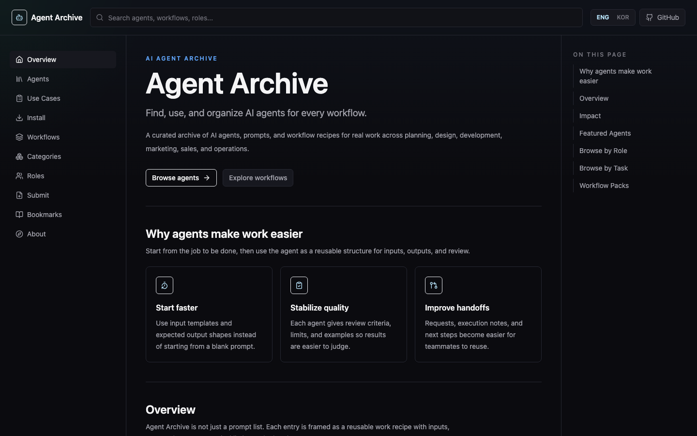
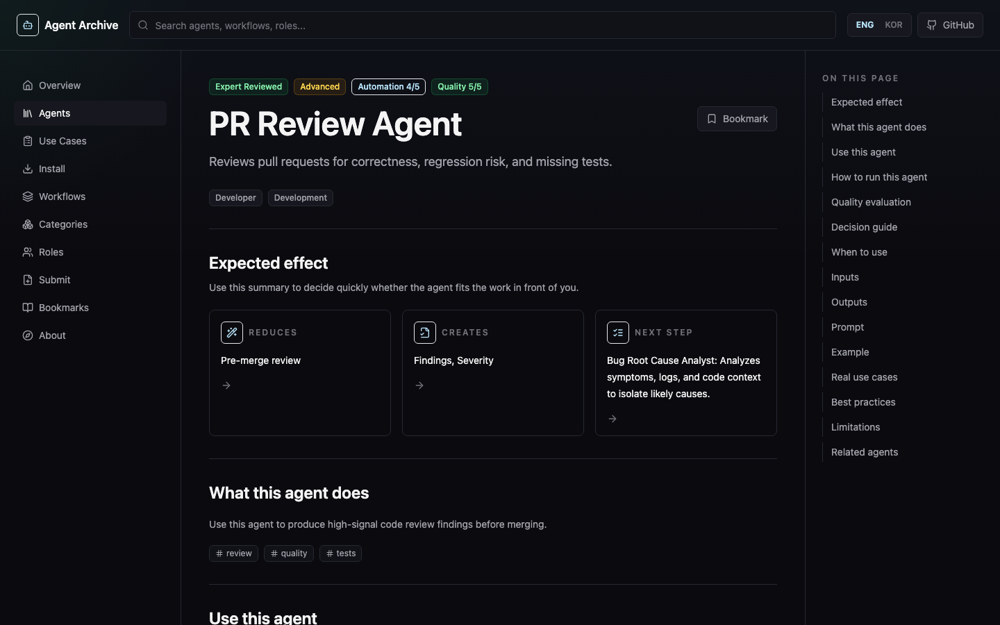
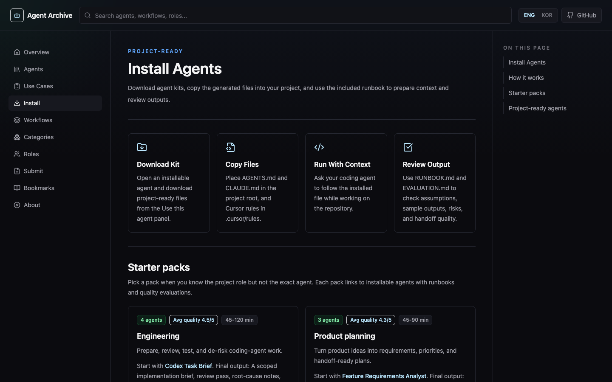

<div align="center">


# Agent Archive

**실무에 바로 쓰는 AI 에이전트 오픈소스 라이브러리. 에이전트마다 프롬프트, 런북, 품질 평가, 그리고 Codex·Claude Code·Cursor용 설치 키트를 제공합니다.**

[](https://github.com/yohan-work/agentive/actions/workflows/ci.yml)
[](./LICENSE)
[](./LICENSE-CONTENT.md)
[](https://nextjs.org)
[](https://www.typescriptlang.org)
[](#기여하기)

[주요 기능](#주요-기능) · [빠른 시작](#빠른-시작) · [설치 키트](#설치-키트) · [기여하기](#기여하기) · [English](./README.md)



</div>

## 왜 Agent Archive인가요?

대부분의 프롬프트 모음은 "이 텍스트를 복사하세요"에서 끝납니다. 실제 프로젝트에서는 그다음 질문에 답할 수 있어야 합니다.

- 이 에이전트를 **언제** 써야 하고, 언제는 쓰지 말아야 하는지
- **어떤 맥락**을 넣어야 하고, 어떤 입력이 나쁜 입력인지
- 결과를 믿기 전에 **무엇을 기준으로** 검토해야 하는지
- 지금 작업하는 곳에 **어떻게 설치**하는지 (`AGENTS.md`, `CLAUDE.md`, Cursor 규칙)

Agent Archive는 에이전트를 재사용할 수 있는 업무 레시피로 다룹니다. 에이전트마다 입력, 출력, 한계, 검토 기준을 정리해 두었고, 프로젝트용 에이전트는 저장소에 바로 넣어 쓸 수 있습니다.

## 주요 기능

- **에이전트 100개**: 9개 직군과 11개 카테고리에 걸쳐 PRD 리뷰부터 장애 회고까지 다룹니다.
- **프로젝트용 에이전트 20개**: 런북, 품질 평가, 샘플 실행 결과를 갖추고 있고 설치 키트를 클릭 한 번으로 받을 수 있습니다.
- **설치 키트**: Codex(`AGENTS.md`), Claude Code(`CLAUDE.md`), Cursor(`.mdc` 규칙) 파일에 `agent.json`, `RUNBOOK.md`, `EVALUATION.md`가 함께 들어 있습니다.
- **워크플로우 팩**: 여러 에이전트를 하나의 흐름으로 엮은 플레이북입니다. 단계 사이의 인수인계를 시각적으로 보여줍니다.
- **스타터 팩**: 엔지니어링, 제품 기획, 디자인 QA, 운영 문서 영역별로 에이전트를 묶었습니다.
- **검색과 필터**: 직군, 카테고리, 도구, 난이도, 자동화 수준으로 좁힐 수 있고 프로젝트용 에이전트만 볼 수도 있습니다.
- **내보내기**: 에이전트 카드 전체를 복사하거나 Markdown 또는 JSON으로 내려받을 수 있습니다.
- **북마크**: 브라우저에 로컬로 저장되므로 계정이 필요 없습니다.
- **영어와 한국어 UI**

<table>
  <tr>
    <td></td>
    <td></td>
  </tr>
  <tr>
    <td align="center"><sub>에이전트 상세: 기대 효과, 런북, 품질 평가</sub></td>
    <td align="center"><sub>설치: 스타터 팩과 프로젝트용 에이전트</sub></td>
  </tr>
</table>

## 빠른 시작

Node.js 20.9 이상과 npm이 필요합니다.

```bash
git clone https://github.com/yohan-work/agentive.git
cd agentive
npm install
npm run dev
```

http://localhost:3000 에 접속하면 `/en`으로 이동합니다. 한국어 화면은 `/ko`에서 볼 수 있습니다.

## 설치 키트

프로젝트용 에이전트 상세 화면의 *Use this agent* 패널에서 **Download Kit**을 누르면 아래 파일을 받습니다.

```text
pr-review-agent-AGENTS.md         # Codex 등 AGENTS.md를 읽는 도구용 지침
pr-review-agent-CLAUDE.md         # Claude Code 프로젝트 지침
pr-review-agent-cursor-rule.mdc   # Cursor 프로젝트 규칙
pr-review-agent-agent.json        # 기계가 읽는 매니페스트
pr-review-agent-README.md         # 설치 안내
pr-review-agent-RUNBOOK.md        # 준비할 맥락, 좋은 입력과 나쁜 입력, 결과 체크리스트
pr-review-agent-EVALUATION.md     # 품질 점수, 알려진 약점, 샘플 실행 결과
```

받은 파일은 도구에 맞는 위치에 둡니다.

| 도구 | 파일 위치 |
| --- | --- |
| Codex 등 `AGENTS.md`를 읽는 에이전트 | 저장소 루트의 `AGENTS.md`에 내용을 추가 |
| Claude Code | 저장소 루트의 `CLAUDE.md`에 내용을 추가 |
| Cursor | `.cursor/rules/<name>.mdc`로 저장 |

## 구조

Agent Archive는 데이터베이스나 백엔드 없이 **정적 데이터를 기준으로 하는** Next.js 앱입니다. **에이전트 하나는 `content/agents/`의 YAML 파일 하나**이고 JSON Schema로 검증합니다. 워크플로우와 분류 정보는 `src/data`에 타입이 지정된 데이터로 둡니다.

```text
content/
├── agents/           # 에이전트 하나당 YAML 파일 하나 (원본 데이터)
└── TEMPLATE.yaml     # 새 에이전트 작성용 템플릿
schema/
└── agent.schema.json # src/types/agent.ts에서 생성한 JSON Schema
src/
├── app/              # Next.js App Router 페이지 (로케일 경로: /en, /ko)
├── components/       # UI: 에이전트, 워크플로우, 레이아웃, 공통 컴포넌트
├── data/             # 워크플로우, 스타터 팩, 분류, 에이전트 로더
├── i18n/             # 로케일 설정과 UI 문구
├── lib/              # 검색, 내보내기, 설치 키트 생성
└── types/            # 에이전트, 워크플로우, 분류 타입
scripts/
├── build-content.mjs # content/agents를 앱용으로 묶음
├── generate-schema.mjs
└── check-data.mjs    # 스키마와 무결성 검사 (slug, 참조, 필수 메타데이터)
```

| 명령 | 설명 |
| --- | --- |
| `npm run dev` | 개발 서버 실행 |
| `npm run build` | 프로덕션 빌드 |
| `npm run lint` | ESLint 실행 |
| `npm run typecheck` | TypeScript 타입 검사 |
| `npm run check:data` | 에이전트 스키마 검증과 워크플로우·분류 참조 검사 |
| `npm run schema` | `schema/agent.schema.json` 다시 생성 |

## 기여하기

새 에이전트, 더 나은 프롬프트, 솔직한 평가 모두 환영합니다. 어떤 기여를 받는지와 에이전트 검증 단계는 **[기여 가이드](./CONTRIBUTING.md)**(영문)에 정리되어 있습니다.

- **에이전트 제안**: [Suggest an agent](https://github.com/yohan-work/agentive/issues/new?template=new-agent.yml) 이슈를 열거나 사이트의 Submit 페이지를 이용해 주세요.
- **에이전트 추가·개선**: `content/TEMPLATE.yaml`을 복사하거나 `content/agents/`의 기존 파일을 고친 뒤, `npm run check:data`를 실행하고 PR을 보내주세요.
- **버그 신고**: [버그 리포트 열기](https://github.com/yohan-work/agentive/issues/new?template=bug-report.yml)
- **보안 이슈**: 공개 이슈 대신 비공개로 신고해 주세요 ([SECURITY.md](./SECURITY.md) 참고).

이 프로젝트는 [Contributor Covenant](./CODE_OF_CONDUCT.md)를 따릅니다. AI 코딩 에이전트는 [AGENTS.md](./AGENTS.md)를 먼저 읽어주세요.

## 로드맵

- [x] 에이전트 하나당 파일 하나로 분리하고 스키마로 검증
- [ ] 공개 URL로 사이트 호스팅
- [ ] 브라우저 없이 URL로 설치 키트 받기
- [ ] 직접 검증한 에이전트와 샘플 실행 결과 확충

## 라이선스

- 코드: [MIT](./LICENSE)
- `content/`와 `src/data`의 에이전트 콘텐츠(프롬프트, 런북, 평가, 워크플로우): [CC BY 4.0](./LICENSE-CONTENT.md)

내보낸 프롬프트와 설치 키트는 상업 프로젝트를 포함해 자유롭게 쓸 수 있습니다. 출처를 밝혀주시면 감사하겠습니다.
